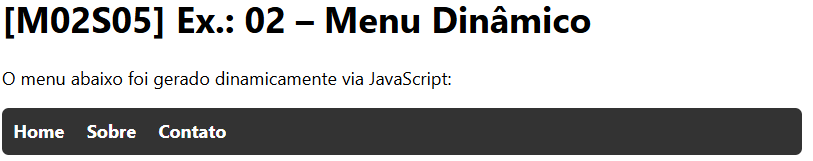

# [M02S05] Ex.: 02 – Menu Dinâmico

Exercício de manipulação do DOM em JavaScript.

## Objetivo
Gerar dinamicamente um menu de navegação (`<nav>`) a partir do array:

```js
["Home", "Sobre", "Contato"]
```

## Resultado
